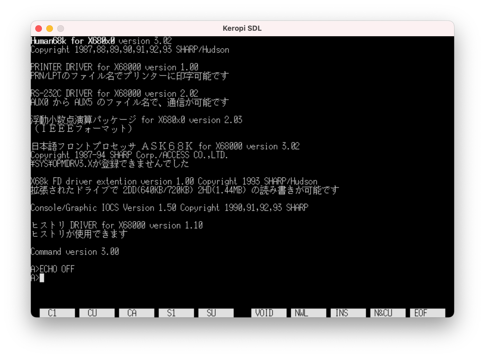
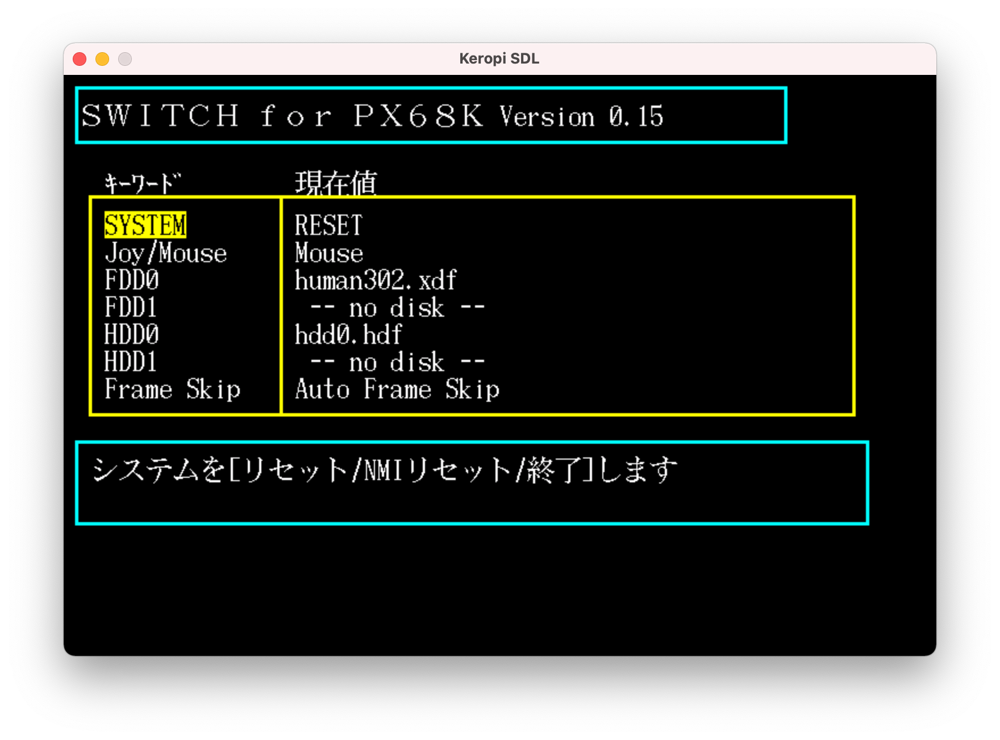

# px68k

## About

* X68000 Emulator forked from <https://github.com/kenyahiro/px68k/>
* Changed to support Apple Silicon Mac. May not work on the other platforms (iOS, Android, PSP, Windows, ...)

## Setup

* Please refer to the [Original Document](./doc/kero_src.txt)
* Necessary ROMs which Sharp made available for free are mirrored [here](http://retropc.net/x68000/software/sharp/)

## How to run

* Run `px68k -h` to show command line arguments

```sh
$ ./px68k -h
Usage: ./px68k [-h,--help] [-v,--verbose] [-0,--fd0] [-1,--fd1]

Arguments:
    -h, --help       Show this help message and exit
    -v, --verbose    Verbose output
    -0, --fd0        FD0 image path
    -1, --fd1        FD1 image path
```

* Then run like this

```sh
./px68k --fd0 human302.xdf
```



* `F12` shows some optional parameters / floppy disk change



## HDD

### How to make a SASI disk (up to 40MB)

* Create an empty 40MB file

```sh
dd bs=4096 count=10240 if=/dev/zero of=hdd0.hdf
```

* Edit `$HOME/.keropi/config` and add HDD0=hdd0.hdf
* Run Human68k and run `switch` to edit the max HDD to 1 (or more)
* Run Human68k and run `format` to initialize it (quick) and allocate space (takes a few mins)
* After booting from the SASI HDD (`A` drive), copy Human68k system from fdd0 (`B` drive) by `copyall b:\bin\copyall b:\*.* a:`

### How to make a SCSI disk

* There is no easy way. Please use XM6 or other emulator and copy the created one

## Keyboard Mapping

* Key assignment changed for US keyboard
* Plus, the following keys are added
  * F13/PrintScrieen ... 'ろ' key on X68000. If you press SHIFT + F13, it'll input `_` (underscore)
  * F14 ... Roman key to input half width Katakana
  * F15 ... Opt.1 key to boot from Floppy Drive 0 even if the default is HDD0 or SCSI0
  * Left Option (Apple) / Alt (Win) ... toggle no-wait (same as F12 menu's one)

## Limitation

* Mouse support it limited. SX-Window's mouse cursor doesn't automatically synchronize with the host OS

## TODO

* WinDRV to send/receive files between the emulator and Mac
